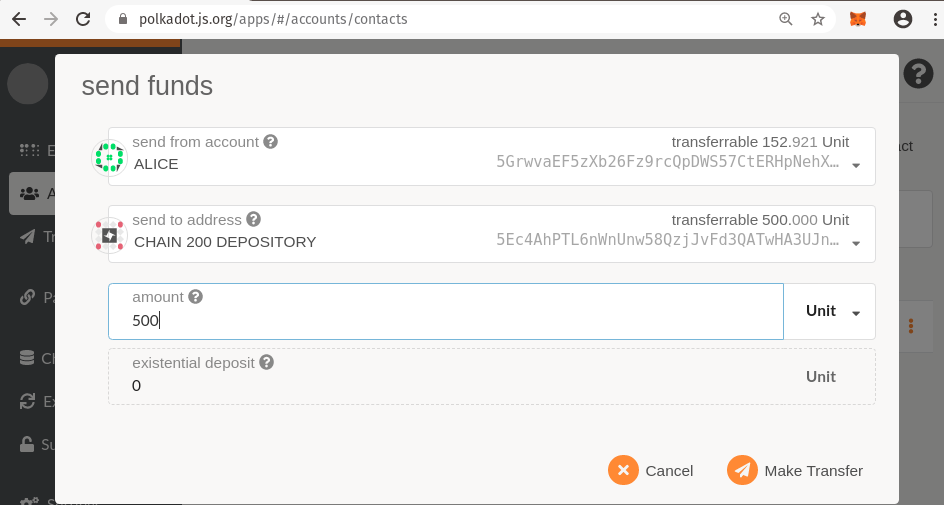
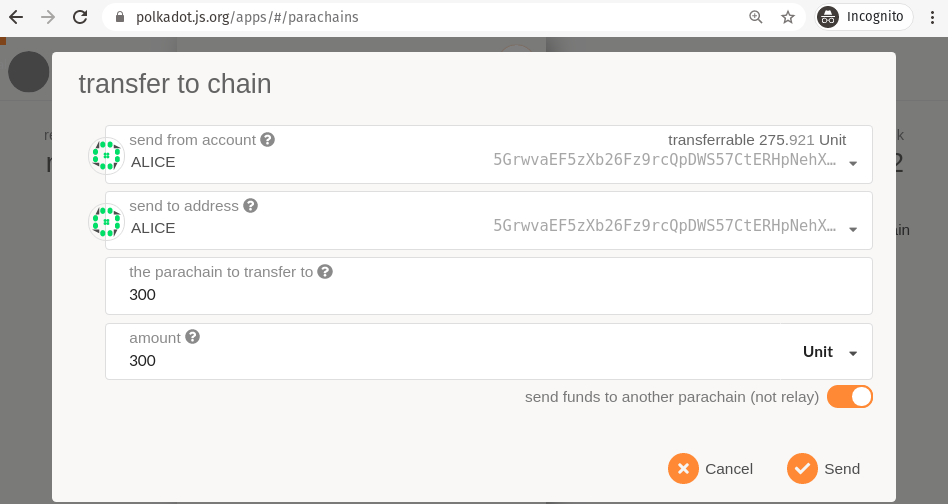

# 横向转账

> 为了执行这些步骤，您必须注册两个不同的平行链。如果您只有一个平行链，请跳过这一部分。

> 在本文中，我们将假设您的平行链被注册在IDs 200 和 300。如果您已经使用了不同的IDs，请相应的修改这些指令。


## XCMP的状态

横向转账最终将通过XCMP实现，消息将直接从一个平行链发送到另一个平行链。这还没有实现，但是我们仍然可以依靠中继链使用跨链转账为我们传递消息。
最终的结果是一样的，但是我们并不期望在真正的XCMP可用时获得相同的性能。更多详细信息，请参阅https://github.com/paritytech/polkadot/wiki/Cross-Chain-Message-(XCM)-format


## 质押模型

跨链转账使用类似于向下转账的质押模型。但是，它不允许链在同级链上创建由代币支持的代币，因为同级链不能相互信任。
这意味着为了将代币从链200转到链300，必须在链100的质押中已经有链200拥有的代币。


> 在我个人看来，这种模式在这里没有多大的意义，因为没有希纳是世界的情况会导致链200在链100上有标记。这个模型将来可能会被再次访问。


## 提前给质押资金

在我们的可以将代币从Alice的链200向她的链300转账之前，我们必须确保链200在链300的专门账户中有一些代币。我们将通过定期转移目标链300上的质押来做到这一点。
每一个平行链都有一个用作质押的账户，而且当您的验证者节点第一次启动时，您可以通过查看日志了解这个账户的地址。
平行链200的账户是`5Ec4AhPTL6nWnUnw58QzjJvFd3QATwHA3UJnvSD4GVSQ7Gop`


您可以通过查看这样的日志来了解您自己平行链的质押地址：


```
2020-06-23 08:43:35 Parachain Account: 5Ec4AhPTL6nWnUnw58QzjJvFd3QATwHA3UJnvSD4GVSQ7Gop
```

<!-- this tip is not compatible with the --tmp flag as I've advised. consider removing the tip

> Protip, if this log is above the scroll for you, just kill your collator and restart it. It will produce the log
> message again.
-->

使用连接到平行链300(接收者)的用户界面，定期将任何账户的余额转入质押账户。
Using a UI connected to Parachain 300 (the recipient) make a regular balance transfer from any
account into the depository account.



## 横向发送代币

在平行链200(源)上提交外部消息返回到 `平行链` 标签和单击"给链转账"的按钮。




## 确认收到代币

在平行链100中，查看账户选项，您应该可以看到代币被转入Alice账户，并从平行链200的质押账户转出。


<!-- I did not observe this to be the case. Should it be? If not tokens are burned on the sending side but not minted anywhere

You can also confirm that on parachain 200 (the source) the tokens have been added to the Parachain 100's (the destination) depository. (The address for parachain 100 is `5Ec4AhP76KFCLR6Q8c8XFnN7pCW7uV2o6gyrBCZJYq1VEhdT`)
-->
